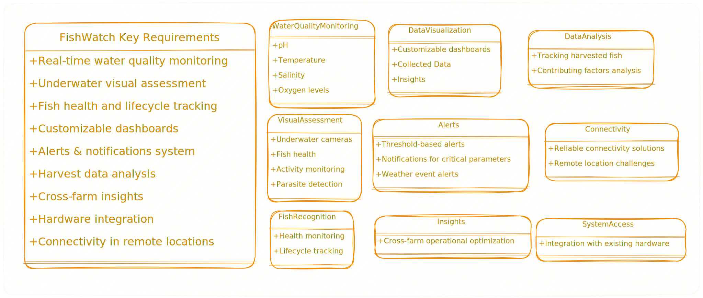
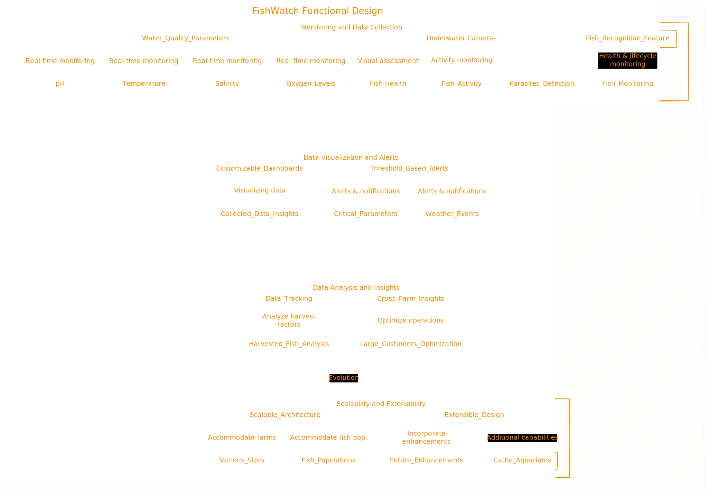
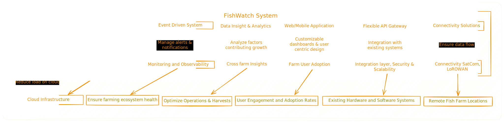

# FishWatch 

  

---

# [Table Of Contents](#table-of-contents-)
- [Prologue](#prologue-)
- [Our Insight](#our-insight-)
- [Lets Talk Business - FishWatch Key Requirements](#lets-talk-business---fishwatch-key-requirements-)
- [Solution Approach](#solution-approach-)
- [Architecture Work](#architecture-work-)
- [Components & Systems - Our BeeHives](#components--systems---our-beehives-)
- [Decisions - Focus is Honey](#decisions---focus-is-honey-)
- [Operational Strategy - No Fishy Deals](#operational-strategy---no-fishy-deals-)
- [Evolve - You adapt change](#evolve---you-adapt-change-)

## Prologue  [🔝](#fishwatch)
Livestock Insights Incorporated, a pioneer in the field of livestock monitoring solutions, is expanding its expertise into the realm of aquaculture with the introduction of the FishWatch system. This innovative platform is strategically designed to transform the aquaculture industry by providing fish farmers with real-time insights into water quality, fish health, and environmental conditions. By leveraging advanced technology, FishWatch aims to enable proactive management and optimization of fish farm operations, thus enhancing the overall productivity and sustainability of aquaculture practices.The development of the FishWatch system is driven by the increasing demand for efficient and data-driven fish farming solutions. As the global population continues to grow, so does the demand for seafood. Aquaculture has emerged as a vital industry to meet this demand, but it faces challenges such as disease outbreaks, environmental pollution, and resource management. FishWatch addresses these challenges by offering a comprehensive monitoring solution that empowers fish farmers to make informed decisions, reduce risks, and maximize yields.

## Our Insight  [🔝](#fishwatch)

    
  - [Kushagra Rana](https://www.linkedin.com/in/kushagrar/)
  - [Salil Sharma](https://www.linkedin.com/in/salil-sharma-36170b24/)
  - [Pratik Purohit](https://www.linkedin.com/in/pratik-kumar-purohit-a776844b/)
    
  We specialize in scalable and robust systems, committed to delivering cutting-edge solutions that cater to the unique needs of our clients. 

## Lets Talk Business - FishWatch Key Requirements [🔝](#fishwatch)
The FishWatch system addresses the diverse needs of fish farmers, offering comprehensive monitoring and management capabilities for multiple farms across various geographical locations. The system aims to enhance the efficiency and effectiveness of fish farming operations through real-time data collection, advanced analytics, and timely alerts.

 

### Key Characteristics

- **Real-Time Monitoring**: Essential for timely decision-making and proactive management.
- **Scalability**: Ability to handle increasing data volume and user base as farms expand.
- **Customizability**: Dashboards and alerts should be tailored to individual farmer needs.
- **Integration**: Seamless compatibility with existing fish farm hardware and software systems.
- **User-Friendly Interface**: Intuitive design for easy access and interpretation of data.
- **Reliability**: Functionality in remote locations and under challenging conditions.
- **Extensibility**: Capability to incorporate future enhancements and additional features.

### Constraints in FishWatch Requirements

- **Connectivity**: Limited or unreliable network availability in remote areas.
- **Data Accuracy**: Critical importance of precise sensor and camera data.
- **Security and Privacy**: Robust measures needed to protect sensitive information.
- **Regulatory Compliance**: Adherence to data security, environmental, and farming regulations.
- **Environmental Conditions**: Durability of hardware components under harsh conditions.

Ref: [FishWatch Requirements Document](./requirements/FishWatch_livestockinsightsinc.pdf)

## Solution Approach [🔝](#fishwatch)
Our methodology for designing the FishWatch system was centered around a comprehensive and collaborative approach. We began with a thorough analysis of the aquaculture industry's needs and the specific requirements outlined by Livestock Insights Incorporated.

- **Functional Design**: Based on the requirements, We focus on creating a solution that is not only technologically advanced but also practical and user-friendly for fish farmers.
  
 

<h4 align="center">Fig. FishWatch Functional Design 1</h4>

### Stakeholders of the FishWatch System

- **Fish Farmers**: Manage daily fish farm operations.
- **Industry Experts**: Offer guidance on system use and best practices.
- **Fishery Management**: Oversee fisheries' regulation and sustainability.
- **Aquatic Health Professionals**: Focus on the health of aquatic species.
- **Meteorological Agencies**: Provide weather data for farm management.
- **Research Institutions**: Study aquaculture and related fields.
- **Regulatory Bodies**: Ensure compliance with environmental standards.
- **Technology Suppliers**: Provide hardware, software, and services.
- **Financial Stakeholders**: Support the initiative with funding.
- **Consumer Advocacy Groups**: Represent interests regarding product quality and sustainability.

### Some Assumptions
- **Reliable Sensor Data**: Sensors and underwater cameras are assumed to provide accurate and reliable data for monitoring water quality and fish health.
- **Scalable Cloud Infrastructure**: The cloud platform is assumed to have dynamic scaling capabilities to handle varying data volumes and user numbers.
- **User Adoption and Training**: Fish farmers are assumed to be receptive to adopting the FishWatch system, with adequate training provided for effective use.
- **Integration Compatibility**: Existing hardware and software systems at fish farms are assumed to support standard communication protocols and APIs for seamless integration.
- **Regulatory Compliance**: The FishWatch system is assumed to comply with all relevant data security, privacy, and environmental monitoring regulations.
- **Extensibility for Future Enhancements**: The system is designed to be extensible, with the assumption that future enhancements will not require a complete architectural overhaul.
- **Cross-Farm Insights**: For large customers, the system is assumed to be capable of aggregating and analyzing data across different farm locations to provide comprehensive insights.

## Architecture Work [🔝](#fishwatch)
Our architectural work for the FishWatch system was guided by a deep understanding of the aquaculture industry's needs and the specific requirements of Livestock Insights Incorporated. we crafted a modular and scalable architecture that addresses the core objectives of real-time data processing & monitoring, data analysis, connectivity and user accessibility.

 

<h4 align="center">Fig. FishWatch System Design 1</h4>

## High-Level Architecture Components

### **Edge Layer**       **❓** [Use of Edge Computing](./ADRs/Use%20of%20Edge%20Computing.md)
Edge devices collect and locally process data from farm enclosures, playing a critical role in the FishWatch ecosystem.
- **IoT Devices**: Devices equipped with sensors and cameras for data collection and initial processing.
- **Edge Computing**: Utilizes frameworks like AWS Greengrass or Azure IoT Edge to process data at the edge.

### **Cloud Platform**      **❓** [Cloud Platform Selection](./ADRs/Cloud%20Platform%20Selection.md)
The cloud platform is the central hub for FishWatch, providing robust, scalable services that process, store, and analyze data from various edge devices.

#### **Compute**
- **Kubernetes Clusters**: Hosted on AWS EKS or Azure AKS for container orchestration.
- Facilitates the deployment and management of microservices.

#### **Data Storage**
- **Time-Series Database**        **❓** [Time-Series Database Implementation](./ADRsTime-Series%20Database%20Implementation.md): InfluxDB for real-time sensor data management and queries.
- **Data Lake**        **❓** [Data Lake for Historical Data Analysis](./ADRs/Data%20Lake%20for%20Historical%20Data%20Analysis.md): AWS S3 or Azure Data Lake Storage for storing vast amounts of unstructured data.

#### **Data Processing and Analytics**       **❓** [Data Processing Framework for Real-Time Analytics](./ADRs/Data%20Processing%20Framework%20for%20Real-Time%20Analytics.md)
- **Stream Processing**: Apache Kafka for managing real-time data streams.
- **Batch Processing**: Apache Spark for complex batch computations.

#### **Machine Learning and Insights**       **❓** [AI and Machine Learning Framework Selection](./ADRs/Machine%20Learning%20Framework%20Selection.md)
- **Machine Learning Platforms**: TensorFlow or PyTorch for building and deploying ML models, with AWS SageMaker or Azure Machine Learning.
- **Business Intelligence**: Integration with Tableau or Microsoft Power BI for generating actionable insights through interactive dashboards.

#### **API Management**       **❓** [API Gateway for Secure API Management](./ADRs/API%20Gateway%20for%20Secure%20API%20Management.md)
- **API Gateway**: AWS API Gateway or Azure API Management for secure and scalable API interactions.

#### **Security**
- **Identity and Access Management**: AWS IAM or Azure Active Directory.
- **Encryption and Data Protection**: AWS KMS or Azure Key Vault for data encryption.             

### **Monitoring, Alerting, and Reporting**       **❓** [Monitoring and Logging Strategy](./ADRs/Monitoring%20and%20Logging%20Strategy.md)
Proactive system monitoring and custom reporting tools provide insights and alert farmers to potential issues in real-time.
- **Monitoring Tools**: Prometheus and Grafana for system monitoring and visualizing metrics.
- **Logging**: ELK Stack (Elasticsearch, Logstash, Kibana) for centralized log management.

### **User Interfaces**
Accessible, intuitive user interfaces allow fish farmers to monitor their operations easily and make informed decisions based on real-time data and insights.
- **Web and Mobile Applications**       **❓** [Customizable Dashboards for Visualization and BI](./ADRs/Customizable%20Dashboards%20for%20Visualization%20and%20BI.md): SPA frameworks like React or Angular for web interfaces, and React Native or Flutter for mobile apps.

### **Connectivity Solutions**       **❓** [Connectivity Solutions for Remote Locations](./ADRs/Connectivity%20Solutions%20for%20Remote%20Locations.md)
Ensuring reliable connectivity for data transmission is essential, especially in remote locations with limited infrastructure.
- **Hybrid Connectivity**: A combination of satellite communications, cellular networks, and LPWAN technologies like LoRaWAN to maintain constant, reliable data transmission.

### **Disaster Recovery and Backup**       **❓** [Disaster Recovery and Data Backup Strategy](./ADRs/Disaster%20Recovery%20and%20Data%20Backup%20Strategy.md)
Robust strategies to ensure data integrity and system availability in case of failures.
- **Backup and Recovery**: Automated snapshots, cross-region replication, and disaster recovery planning with AWS or Azure services.

    
### High-Level Architecture Diagram
 

## Components & Systems - Our BeeHives [🔝](#fishwatch)
- **Data Ingestion Service**: Ensures reliable data collection, employing message queues for data spikes and processors for validation.
- **Data Storage**: 
  - **Time-Series Database**: Optimized for storing and querying sensor data.
  - **Data Lake**: Archives historical data and video feeds for deep analysis.
- **Analytics Service**: 
  - **Real-time Analytics**: Analyzes data streams for immediate insights.
  - **Machine Learning**: Develops models for predictive analytics and anomaly detection.
- **API Gateway**: 
  - Facilitates secure and efficient API management.
  - Routes API requests to appropriate services.
  - Enforces rate limiting for fair usage.
- **Security Service**: 
  - **Authentication**: Verifies user identities and manages sessions.
  - **Authorization**: Controls access based on user roles.
  - **Compliance**: Ensures adherence to regulatory standards.

## Decisions - Focus is Honey [🔝](#fishwatch)
- [Use of Edge Computing](./ADRs/Use%20of%20Edge%20Computing.md)
- [Microservices Architecture](./ADRs/Microservices%20Architecture.md)
- [Cloud Platform Selection](./ADRs/Cloud%20Platform%20Selection.md)
- [Time-Series Database Implementation](./ADRs/Time-Series%20Database%20Implementation.md)
- [Customizable Dashboards for Visualization and BI](./ADRs/Customizable%20Dashboards%20for%20Visualization%20and%20BI.md)
- [Data Lake for Historical Data Analysis](./ADRs/Data%20Lake%20for%20Historical%20Data%20Analysis.md)
- [Security and Compliance Measures](./ADRs/Security%20and%20Compliance%20Measures.md)
- [Connectivity Solutions for Remote Locations](./ADRs/Connectivity%20Solutions%20for%20Remote%20Locations.md)
- [Data Processing Framework for Real-Time Analytics](./ADRs/Data%20Processing%20Framework%20for%20Real-Time%20Analytics.md)
- [API Gateway for Secure API Management](./ADRs/API%20Gateway%20for%20Secure%20API%20Management.md)
- [Monitoring and Logging Strategy](./ADRs/Monitoring%20and%20Logging%20Strategy.md)
- [Disaster Recovery and Data Backup Strategy](./ADRs/Disaster%20Recovery%20and%20Data%20Backup%20Strategy.md)

## Operational Strategy - No Fishy Deals [🔝](#fishwatch)
- **Deployment**: Automated deployment pipelines for consistent and reliable updates to the FishWatch system.
- **Monitoring and Logging**: Utilized tools like Prometheus, Grafana, and the ELK Stack for system monitoring and log management.
- **Disaster Recovery**: Cloud-based backup and replication strategies to ensure data integrity and system availability.

## Evolve - You adapt change [🔝](#fishwatch)
- **Scalability Plans**: Designed to scale horizontally, allowing for increased capacity as the number of farms and data volume grows.
- **Extensibility Considerations**: Modular architecture enables the addition of new features and integration with emerging technologies.
- **Future Enhancements**: Potential integration with advanced sensors, IoT devices, and AI-driven analytics for enhanced fish health monitoring and environmental management.

---
